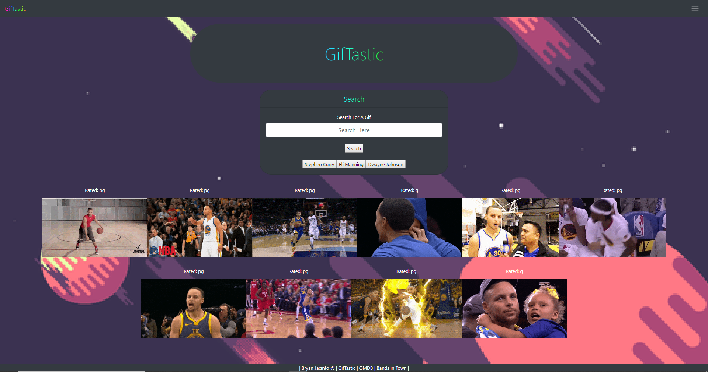

# GifTastic-OMDB-BandsinTown
### Links: 
https://bryanjacinto1994.github.io/GifTastic-OMDB-BandsinTown/
<br>
https://github.com/bryanjacinto1994/Trivia-Game


## Images




<hr>

## Tools Used:

* Visual Studio Code - Open source code editor for building and debugging web and cloud applications.
* JavaScript - A scripting language that uses curly-bracket syntax, first class functions and object-oriented.
* jQuery - A JavaScript library that simplifys to manipulate HTML DOM.
* API - Application Programming Interface that simplifys the client-side software between a client and a server.
* JSON -
* HTML - Used to create elements on the DOM.
* CSS - Styles the html elements on page. 
* Git - Version control system to track changes to source code.
* Github - Hosts respository that can be deployed to GitHub pages.


<hr>

## Summary

Using HTML, CSS, JavaScript, jQuery library for JS via Visual Studio Code, and API (Application Programming Interface) was used to make a Gif website using API keys from "https://www.giphy.com".

The api keys was used from the "Giphy" website and used that key along with the .ajax function to call for a request from that server and recieve that request back. Different functions were used such as the on. click function to execute the code within it and shows the buttons and gifs display.

Coming Soon ------ > * OMDB * | * Bands in Town * < ------ Coming Soon

<hr>

## Code Snippet

giftastic.html :
```html
<nav class="navbar navbar-dark bg-dark">
        <a class="navbar-brand" href="#" id="Title">GifTastic</a>
        <button class="navbar-toggler" type="button" data-toggle="collapse" data-target="#navbarSupportedContent"
            aria-controls="navbarSupportedContent" aria-expanded="false" aria-label="Toggle navigation">
            <span class="navbar-toggler-icon"></span>
        </button>
        <div class="collapse navbar-collapse" id="navbarSupportedContent">
            <ul class="navbar-nav mr-auto">
                <li class="nav-item active">
                    <a class="nav-link" href="#">Home <span class="sr-only">(current)</span></a>
                </li>
                <li class="nav-item dropdown">
                    <a class="nav-link dropdown-toggle" href="#" id="navbarDropdown" role="button"
                        data-toggle="dropdown" aria-haspopup="true" aria-expanded="false">
                        Dropdown
                    </a>
                    <div class="dropdown-menu" aria-labelledby="navbarDropdown">
                        <a class="dropdown-item" href="#">GifTastic</a>
                        <div class="dropdown-divider"></div>
                        <a class="dropdown-item" href="#">OMBD (Coming Soon)</a>
                        <div class="dropdown-divider"></div>
                        <a class="dropdown-item" href="#">Bands in Town (Coming Soon)</a>
                    </div>
                </li>
        </div>
    </nav>
    <br>
    <div class="container">
        <div class="jumbotron jumbotron-fluid jumbotron-dark bg-dark"
            style="border-radius: 100px; width: 100%; color: whitesmoke; margin: 0 auto;">
            <div class="container">
                <h1 class="display-4" style="text-align: center; font-size: 60px; margin: 0 auto;" id="Title">
                    GifTastic
                </h1>
            </div>
        </div>
    </div>
    <br>
    <div class="card text-white bg-dark mb-3" style="max-width: 40rem; margin: 0 auto; border-radius: 40px;">
        <div class="card-header" id="Title" style="text-align:center; font-size:24px;">Search</div>
        <div class="card-body">
            <label for="gif-input">Search For A Gif</label>
            <input class="form-control form-control-lg" type="text" id="gif-input" placeholder="Search Here">
            <br>
            <input id="add-gif" type="submit" value="Search">
            <br><br>
            <div id="gif-view"></div>
        </div>
    </div>
    <br>
    <span class="d-flex flex-row flex-wrap my-flex-container justify-content-center" id="gifs-view" style="color: white; height: 550px; border-radius: 100px; margin: 0 auto;"></span>
    <br>
    <div class="fixed-bottom bg-dark" style="text-align: center; color: white;">
       | Bryan Jacinto © | GifTastic | OMDB | Bands in Town |
    </div>
 
```
giftastic.js: 

``` javascript 
var gifs = ["Stephen Curry", "Eli Manning", "Dwayne Johnson"];

$(document).ready(function () {
    function displayGif() {
        $("button").on("click", function () {
            var gif = $(this).attr("data-person");
            var queryURL = "https://api.giphy.com/v1/gifs/search?q=" +
                gif + "&api_key=wslWpWhssAgYDK6zVXacBDsacT47flr4&limit=10";

            $.ajax({
                url: queryURL,
                method: "GET"
            })
                .then(function (response) {
                    console.log(response);
                    console.log(response.data);
                    var responseData = response.data;
                    $("#gifs-view").empty();

                    for (var i = 0; i < responseData.length; i++) {
                        var giphyDiv = $("<div>");
                        var rating = responseData[i].rating;
                        var p = $("<p>").text("Rated: " + rating);
                        var giphyGifs = $("");
                        giphyGifs.attr("src", responseData[i].images.fixed_height_still.url);
                        giphyGifs.attr("data-pause", responseData[i].images.fixed_height_still.url);
                        giphyGifs.attr("data-play", responseData[i].images.fixed_height.url);
                        giphyGifs.attr("data-state", "pause");
                        giphyGifs.addClass("giphy");

                        giphyDiv.append(p);
                        giphyDiv.append(giphyGifs);

                        $("#gifs-view").prepend(giphyDiv);
                    };
                });

        });
    };

    $(document).on("click", ".giphy", function () {
        var state = $(this).attr("data-state");

        if (state === "pause") {
            var animate = $(this).attr("data-play");
            $(this).attr("src", animate);
            $(this).attr("data-state", "play");
        }
        else {
            $(this).attr("src", $(this).attr("data-pause"));
            $(this).attr("data-state", "pause");
        }
    })

    function renderButtons() {
        $("#gif-view").empty();

        for (var i = 0; i < gifs.length; i++) {
            var newButton = $("<button>");
            newButton.addClass("giphy");
            newButton.attr("data-person", gifs[i]);
            newButton.text(gifs[i]);
            $("#gif-view").append(newButton);
        }
    }
    $("#add-gif").on("click", function(event){
        event.preventDefault();

        var giphy = $("#gif-input").val().trim();
        gifs.push(giphy);
        renderButtons();
    })
    $(document).on("click", ".giphy", displayGif);
    renderButtons();
});
```

style.css:

``` css
*{
    text-align: center;
}

body{
    background-image: url("https://media2.giphy.com/media/BHNfhgU63qrks/giphy.gif");
    image-rendering: pixelated;
    background-position: center;
    background-repeat: no-repeat;
    background-attachment: fixed;
    background-size: cover;
    font-family: 'Chilanka', cursive;
}

#Title{
    background-image: -webkit-gradient( linear, left top, right top, color-stop(0, #f22), color-stop(0.15, #f2f), color-stop(0.3, #22f), color-stop(0.45, #2ff), color-stop(0.6, #2f2),color-stop(0.75, #2f2), color-stop(0.9, #ff2), color-stop(1, #f22) );
    background-image: gradient( linear, left top, right top, color-stop(0, #f22), color-stop(0.15, #f2f), color-stop(0.3, #22f), color-stop(0.45, #2ff), color-stop(0.6, #2f2),color-stop(0.75, #2f2), color-stop(0.9, #ff2), color-stop(1, #f22) );
    color:transparent;
    -webkit-background-clip: text;
    background-clip: text;
}
```


## Author Links
Linkedin: https://www.linkedin.com/in/bryan-jacinto-100438aa/

Github:
https://github.com/bryanjacinto1994

